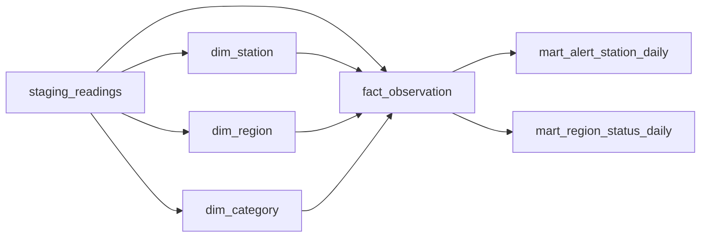

# Schema Diagram

```mermaid
flowchart LR
    staging[staging_readings]
    dimStation[dim_station]
    dimRegion[dim_region]
    dimCategory[dim_category]
    fact[fact_observation]
    martStation[mart_alert_station_daily]
    martRegion[mart_region_status_daily]

    staging --> dimStation
    staging --> dimRegion
    staging --> dimCategory
    staging --> fact
    dimStation --> fact
    dimRegion --> fact
    dimCategory --> fact
    fact --> martStation
    fact --> martRegion
```